# Aegis Architecture Design

## A Synchronous On-Chain Circuit Breaker for Solana DeFi

## Overview

Aegis is a reusable Solana security protocol designed to prevent exploit-driven vault drains and abnormal token outflows before suspicious transactions can commit on-chain.

The protocol has three layers:

1. **Inline Guard Layer**
   - Uses a synchronous `snapshot()` -> protected action -> `evaluate()` pattern.
   - Runs in the same transaction as the protected protocol instruction.
   - Reverts suspicious actions atomically.

2. **Transfer Hook Layer**
   - Uses Token-2022 Transfer Hooks.
   - Evaluates token transfer velocity at the mint level.
   - Blocks abnormal token outflows before the transfer completes.

3. **Governance Layer**
   - Manages thresholds, pause state, reset controls, and simulation mode.
   - Allows protocols to tune circuit breaker behavior over time.

## Diagram Legend

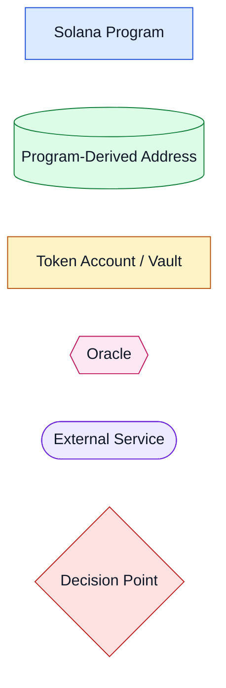

## 1. High-Level System Architecture

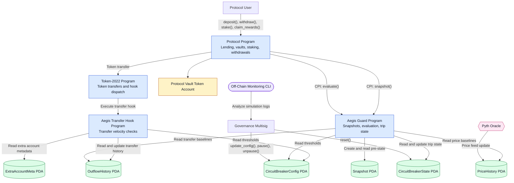

## 2. Program Structure

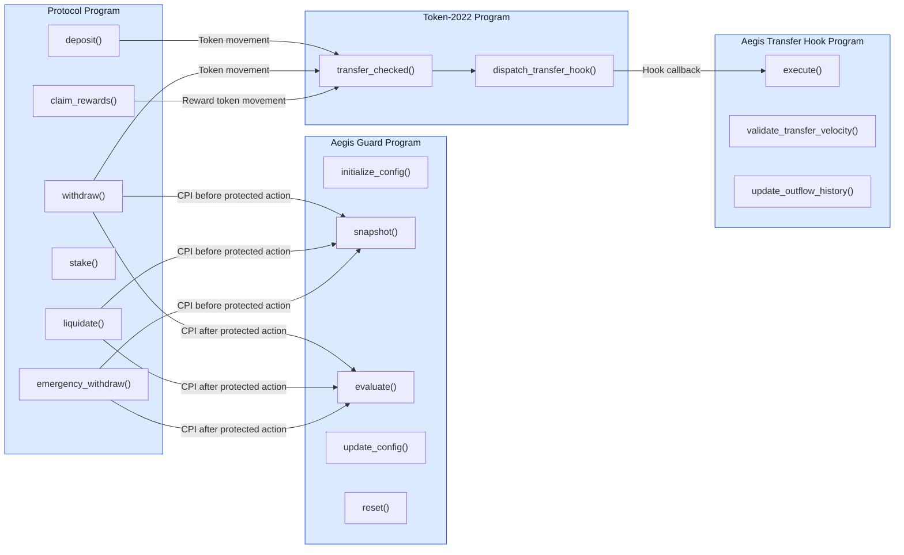

### Program Responsibilities

| Program | Primary Responsibilities | Important Instructions |
| --- | --- | --- |
| Protocol Program | Lending, vault management, staking, user operations | `deposit()`, `withdraw()`, `liquidate()`, `stake()`, `claim_rewards()`, `emergency_withdraw()` |
| Aegis Guard Program | Snapshot creation, delta evaluation, trip management, simulation mode, governance controls | `initialize_config()`, `snapshot()`, `evaluate()`, `update_config()`, `reset()` |
| Aegis Transfer Hook Program | Transfer velocity monitoring, transfer validation, outflow history updates | `execute()` |
| Token-2022 Program | Token transfers, transfer hook dispatch, mint-level extension enforcement | `transfer_checked()`, transfer hook callback |

## 3. Account Structure Mapping

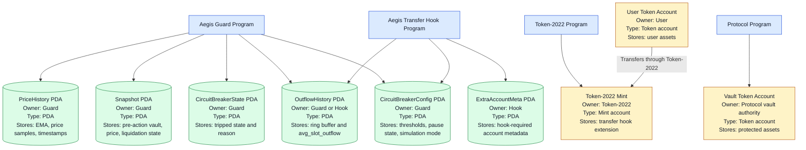

### Account Details

| Account | Owner | Type | Primary Data |
| --- | --- | --- | --- |
| `CircuitBreakerConfig` | Aegis Guard Program | PDA | `velocity_multiplier`, `price_deviation_bps`, `liquidation_multiplier`, `cooldown_slots`, `is_simulation_mode`, `is_paused` |
| `CircuitBreakerState` | Aegis Guard Program | PDA | `is_tripped`, `tripped_at_slot`, `trip_reason`, `delta_value_at_trip`, `threshold_at_trip` |
| `Snapshot` | Aegis Guard Program | PDA | `pre_vault_balance`, `pre_pyth_price`, `pre_liquidation_count`, `snapshot_slot` |
| `OutflowHistory` | Aegis Guard Program or Hook Program | PDA | Ring buffer, `avg_slot_outflow`, historical transfer amounts |
| `PriceHistory` | Aegis Guard Program | PDA | EMA, historical prices, timestamps |
| `ExtraAccountMeta` | Aegis Transfer Hook Program | PDA | Required account metadata for Token-2022 transfer hook execution |
| Vault Token Account | Protocol vault authority | Token account | Protected protocol liquidity |
| User Token Account | User wallet | Token account | User-owned token balance |
| Token-2022 Mint | Token-2022 Program | Mint account | Mint configuration and transfer hook extension |

## 4. PDA Derivation Map

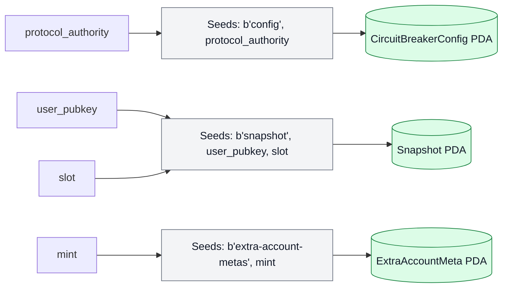

### PDA Seeds

```rust
// CircuitBreakerConfig
[b"config", protocol_authority]

// Snapshot
[b"snapshot", user_pubkey, slot]

// ExtraAccountMeta
[b"extra-account-metas", mint]
```

Additional PDAs such as `CircuitBreakerState`, `OutflowHistory`, and `PriceHistory` should use deterministic seeds tied to the protected protocol, mint, vault, or market so each protected deployment has isolated state.

## 5. Program Interaction Matrix

| Source | Target | Interaction Type | Instruction or Data | Purpose |
| --- | --- | --- | --- | --- |
| User | Protocol Program | Transaction instruction | `deposit()`, `withdraw()`, `stake()`, `claim_rewards()` | User-facing DeFi operations |
| Protocol Program | Aegis Guard Program | CPI | `snapshot()` | Capture pre-action state |
| Protocol Program | Token-2022 Program | CPI | `transfer_checked()` | Move protected assets |
| Token-2022 Program | Aegis Transfer Hook Program | Hook callback | `execute()` | Validate transfer before completion |
| Protocol Program | Aegis Guard Program | CPI | `evaluate()` | Compare post-action state against thresholds |
| Aegis Guard Program | Pyth Oracle / PriceHistory | Account read | Price and EMA data | Detect abnormal price movement |
| Aegis Guard Program | OutflowHistory | Account read | Historical transfer baselines | Detect abnormal outflow velocity |
| Governance Multisig | Aegis Guard Program | Admin instruction | `update_config()`, `reset()` | Tune thresholds and recover from trips |
| Off-Chain Monitor | Governance Multisig | Report | Simulation results | Support threshold calibration |

## 6. User Interaction Flows

### Deposit Flow

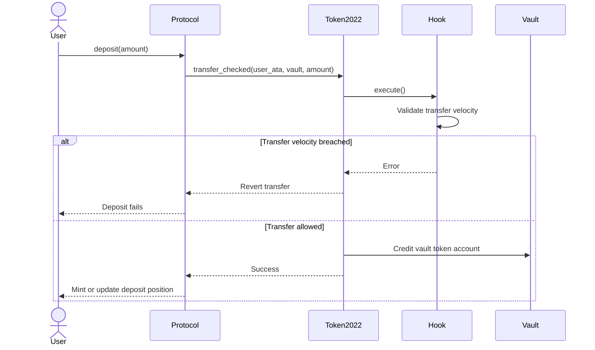

### Withdrawal Protection Flow

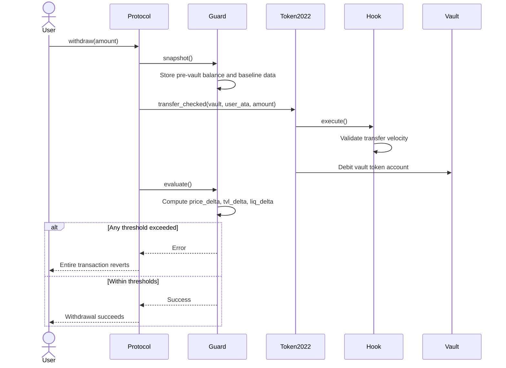

### Staking and Reward Claim Flow

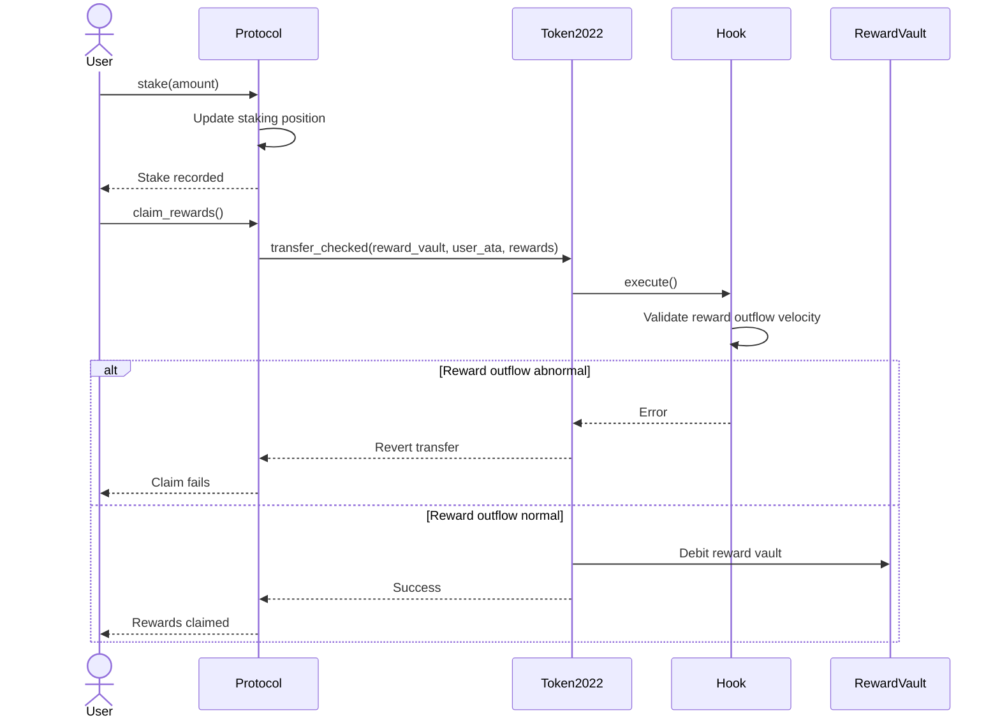

## 7. Circuit Breaker Decision Tree

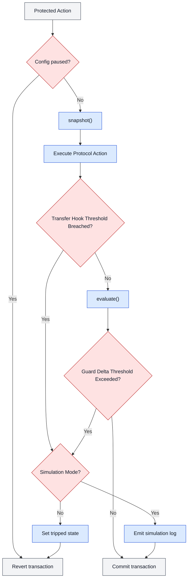

## 8. Transfer Hook Flow

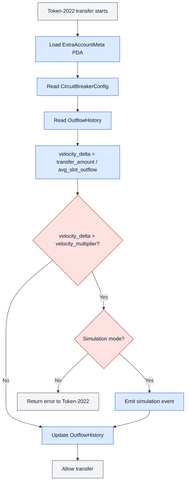

## 9. Delta Calculations

### Price Delta

```text
price_delta =
abs(current_price - ema_price) / ema_price
```

### TVL Delta

```text
tvl_delta =
(pre_balance - post_balance) / pre_balance
```

### Liquidation Delta

```text
liq_delta =
current_liq_rate / historical_liq_rate
```

### Transfer Velocity Delta

```text
velocity_delta =
transfer_amount / avg_slot_outflow
```

## 10. External Dependencies and Integrations

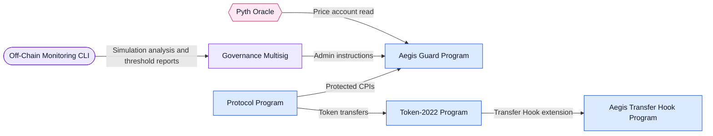

### Dependency Summary

| Dependency | Shape in Diagrams | Integration Point | Purpose |
| --- | --- | --- | --- |
| Token-2022 | Program box | Transfer Hook extension | Mint-level transfer interception |
| Pyth Oracle | Hexagon | Price account reads | Price anomaly detection and EMA updates |
| Off-Chain Monitoring CLI | External service box | Simulation logs and reports | Threshold tuning and deployment validation |
| Governance Multisig | External actor box | Admin instructions | Pause, reset, threshold updates, simulation mode control |

## 11. Governance and Simulation Mode

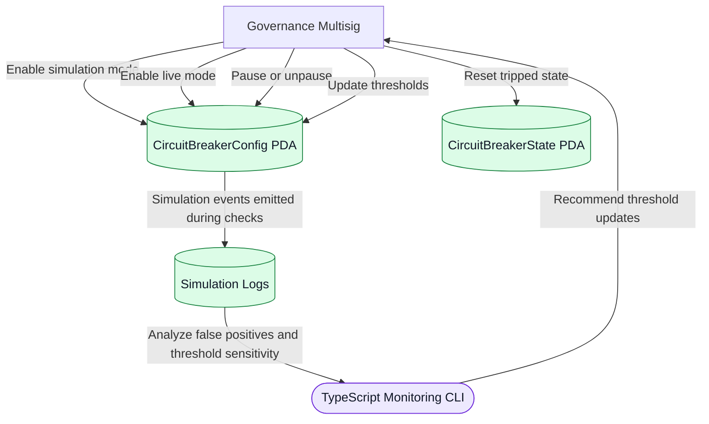

## 12. Error Paths and Alternate Outcomes

| Scenario | Detection Point | Outcome in Live Mode | Outcome in Simulation Mode |
| --- | --- | --- | --- |
| Protocol is paused | Guard config check | Transaction reverts | Transaction reverts |
| Transfer velocity exceeds threshold | Transfer Hook `execute()` | Transfer reverts | Event emitted and transfer may continue |
| TVL delta exceeds threshold | Guard `evaluate()` | Transaction reverts and state may trip | Event emitted and transaction may continue |
| Price delta exceeds threshold | Guard `evaluate()` | Transaction reverts and state may trip | Event emitted and transaction may continue |
| Liquidation rate exceeds threshold | Guard `evaluate()` | Transaction reverts and state may trip | Event emitted and transaction may continue |
| Governance reset | Guard `reset()` | Tripped state clears | Tripped state clears |

## 13. Solana-Specific Design Considerations

- Program modularity is explicit: the Protocol Program owns business logic, the Guard Program owns synchronous circuit breaker evaluation, and the Transfer Hook Program owns mint-level transfer validation.
- CPIs are labeled separately from Token-2022 hook callbacks.
- PDAs are separated from token accounts and external dependencies.
- Protected account state is derived deterministically so each protocol deployment can have isolated configuration, trip state, and history.
- Token movement is routed through Token-2022 when mint-level protection is required.
- Error paths are part of the architecture because suspicious actions must revert before state changes commit.

## 14. Security Assumptions

1. The integrated protocol calls `snapshot()` before protected state changes and `evaluate()` after protected state changes.
2. The governance multisig remains uncompromised.
3. Oracle price feeds remain available and accurate enough for configured thresholds.
4. Historical baselines represent normal protocol behavior.
5. Token-2022 Transfer Hooks are configured on protected mints.
6. Required hook accounts are correctly registered through the `ExtraAccountMeta` PDA.

## 15. Known Limitations

1. Cross-bundle Jito analysis is out of scope.
2. Threshold calibration remains protocol-specific.
3. Transfer Hook protection applies only to Token-2022 assets.
4. False positives remain possible with poorly calibrated baselines.
5. Protocols must integrate the inline guard pattern correctly for atomic withdrawal protection.

## 16. Final Checklist

| Requirement | Status | Where Covered |
| --- | --- | --- |
| All programs represented | Complete | Sections 1 and 2 |
| Individual program responsibilities shown | Complete | Section 2 |
| Program interactions illustrated | Complete | Sections 1, 2, 5, and 6 |
| CPIs and instruction labels included | Complete | Sections 1, 2, and 5 |
| Account structures mapped | Complete | Section 3 |
| Account owners and types included | Complete | Section 3 |
| PDA derivation process shown | Complete | Section 4 |
| External dependencies shown | Complete | Section 10 |
| Decision points and alternate flows included | Complete | Sections 7, 8, and 12 |
| Clear labels and legend included | Complete | Diagram Legend and all Mermaid diagrams |
| Error paths included | Complete | Sections 6, 7, 8, and 12 |

## Summary

Aegis introduces a synchronous security primitive for Solana DeFi by combining an Inline Guard execution model with Token-2022 Transfer Hooks. The Guard Program protects protocol-level actions such as withdrawals and liquidations, while the Transfer Hook Program protects mint-level token movement. Governance and simulation mode allow the protocol to calibrate thresholds before enforcing live reverts, making the architecture suitable for capstone evaluation and real-world Solana protocol integration.
