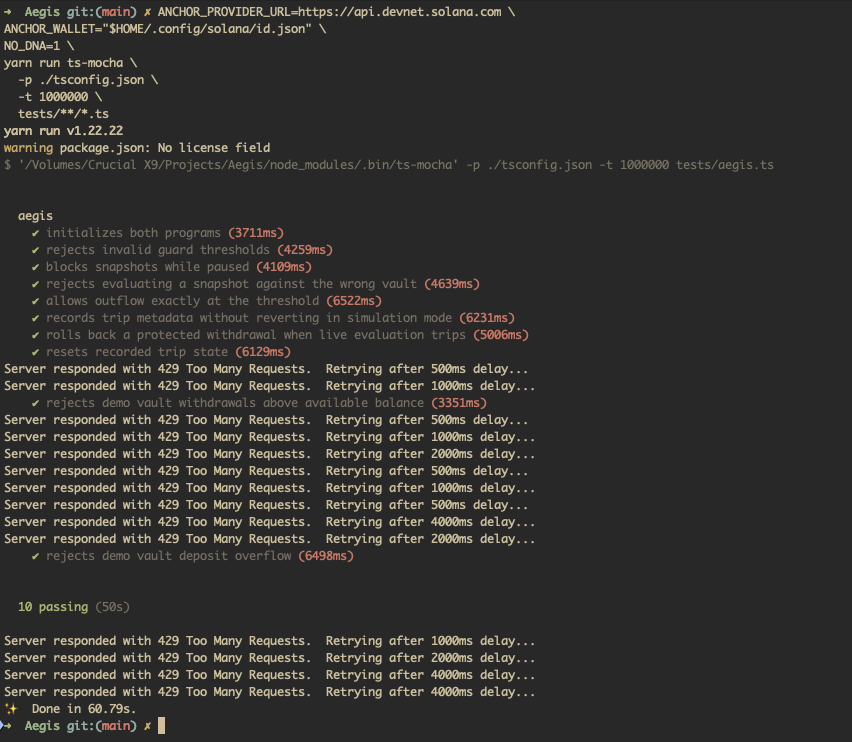

# Aegis

Aegis is an Anchor-based Solana security protocol prototype for synchronous, on-chain circuit breaking around protected protocol actions.

The core idea is simple:

```text
snapshot pre-action state -> run protected action -> evaluate post-action state
```

If the protected action causes a vault outflow above the configured threshold, the guard can trip inside the same Solana transaction. Because Solana transactions are atomic, returning an error from the final guard evaluation rolls back the earlier instructions in that transaction.

## Current Status

This repository currently implements the MVP inline guard layer.

Implemented:

- Anchor workspace with two programs: `aegis_guard` and `demo_vault`
- Guard config, trip state, and snapshot accounts
- Threshold-based outflow evaluation
- Simulation mode support
- Authority-controlled config updates
- Basic reset instruction
- Modular Rust program layout by instruction, state, and errors
- Basic TypeScript smoke test for program initialization

Not implemented yet:

- A full end-to-end test for `snapshot -> protected action -> evaluate`
- CPI integration from `demo_vault` into `aegis_guard`
- SPL Token or Token-2022 vault accounting
- Token-2022 transfer hooks
- Oracle checks, price history, and velocity history
- Cooldown enforcement inside `reset`
- Blocking future guarded actions when `CircuitBreakerState.is_tripped` is true
- Dedicated events/logs for simulation-mode trip reporting

The broader design lives in `docs/ARCHITECTURE.md`; the narrower MVP scope lives
in `docs/mvp_scope.md`.

## Programs

These program IDs are configured for both localnet and devnet:

```text
aegis_guard: Bzt5J5Vw7KHQPp9ZEu9yuPf6GcVaMbMrrUk6m8GkpPSN
demo_vault:  4gTAfDeL3ketKCwZUCRfFjBJMagxUUxpjgEu7KssUsNy
```

| Program       | Program ID                                     | Purpose                                        |
| ------------- | ---------------------------------------------- | ---------------------------------------------- |
| `aegis_guard` | `Bzt5J5Vw7KHQPp9ZEu9yuPf6GcVaMbMrrUk6m8GkpPSN` | Reusable circuit-breaker guard                 |
| `demo_vault`  | `4gTAfDeL3ketKCwZUCRfFjBJMagxUUxpjgEu7KssUsNy` | Minimal demo protocol with an internal balance |

After devnet deployment, the programs can be viewed at:

- `aegis_guard`: `https://explorer.solana.com/address/Bzt5J5Vw7KHQPp9ZEu9yuPf6GcVaMbMrrUk6m8GkpPSN?cluster=devnet`
- `demo_vault`: `https://explorer.solana.com/address/4gTAfDeL3ketKCwZUCRfFjBJMagxUUxpjgEu7KssUsNy?cluster=devnet`

## Devnet Test Results

The complete integration test suite passes against Solana devnet: **10 passing tests**.



## Repository Layout

```text
.
├── Anchor.toml
├── Cargo.toml
├── package.json
├── programs
│   ├── aegis_guard
│   │   ├── Cargo.toml
│   │   └── src
│   │       ├── errors.rs
│   │       ├── instructions
│   │       │   ├── evaluate.rs
│   │       │   ├── initialize_config.rs
│   │       │   ├── mod.rs
│   │       │   ├── reset.rs
│   │       │   ├── snapshot.rs
│   │       │   └── update_config.rs
│   │       ├── lib.rs
│   │       └── state.rs
│   └── demo_vault
│       ├── Cargo.toml
│       └── src
│           ├── errors.rs
│           ├── instructions
│           │   ├── deposit.rs
│           │   ├── initialize.rs
│           │   ├── mod.rs
│           │   ├── update_balance.rs
│           │   └── withdraw.rs
│           ├── lib.rs
│           └── state.rs
├── tests
│   └── aegis.ts
└── docs
    ├── ARCHITECTURE.md
    └── mvp_scope.md
```

## Architecture

### `aegis_guard`

`aegis_guard` is the reusable guard program. Its public Anchor instructions are
declared in `programs/aegis_guard/src/lib.rs`, while the instruction handlers
live under `programs/aegis_guard/src/instructions`.

Instructions:

- `initialize_config`: creates the guard config PDA and state PDA.
- `snapshot`: records pre-action vault balance metadata.
- `evaluate`: compares post-action balance against the snapshot and threshold.
- `update_config`: lets the authority update guard settings.
- `reset`: clears trip state.

Accounts:

- `CircuitBreakerConfig`: authority, thresholds, cooldown, pause state, and
  simulation mode.
- `CircuitBreakerState`: trip flag, trip slot, reason, observed outflow, and
  threshold at trip time.
- `Snapshot`: config, protocol, vault, pre-action balance, and snapshot slot.

Current PDA seeds:

```text
CircuitBreakerConfig: [b"config", authority]
CircuitBreakerState:  [b"state", config]
Snapshot:             [b"snapshot", config, protocol, vault]
```

### `demo_vault`

`demo_vault` is a small demo protocol. It is intentionally not a real token
vault yet; it stores an internal `u64` balance in a program account.

Instructions:

- `initialize`: creates the demo vault PDA.
- `deposit`: increases the internal balance.
- `withdraw`: decreases the internal balance after checking available funds.

Account:

- `DemoVault`: authority, internal balance, and bump.

Current PDA seed:

```text
DemoVault: [b"demo-vault", authority]
```

## Guard Flow

The intended protected-action pattern is:

1. The protected protocol calls `aegis_guard::snapshot` before a sensitive action.
2. The protected protocol performs the action.
3. The protected protocol calls `aegis_guard::evaluate` with the post-action balance.
4. `aegis_guard` calculates the outflow from the pre-action snapshot.
5. If outflow exceeds `max_outflow_bps`, the guard records trip state.
6. If simulation mode is disabled, the guard returns an error and the full transaction rolls back.

The current threshold formula is:

```text
threshold = pre_vault_balance * max_outflow_bps / 10_000
outflow = pre_vault_balance - post_vault_balance
trip if outflow > threshold
```

Example:

```text
pre_vault_balance = 1,000
max_outflow_bps = 1,000   // 10%
threshold = 100

post_vault_balance = 850
outflow = 150

150 > 100, so the circuit breaker trips.
```

## Simulation Mode

When `is_simulation_mode` is `true`, an excessive outflow records trip metadata but does not abort the transaction.

When `is_simulation_mode` is `false`, an excessive outflow returns `CircuitBreakerTripped`, causing the Solana transaction to fail and roll back.

The current code records trip state in simulation mode, but it does not yet emit a dedicated Anchor event or structured log.

## Prerequisites

- Anchor CLI `0.32.1`
- Solana CLI / Agave toolchain
- Rust / Cargo
- Node.js and Yarn

## Setup

Install JavaScript dependencies:

```bash
yarn install
```

Build the Anchor programs:

```bash
NO_DNA=1 anchor build
```

Generated artifacts are written to:

- `target/deploy/*.so`
- `target/idl/*.json`
- `target/types/*.ts`

## Verification

Run Rust workspace tests:

```bash
NO_DNA=1 cargo test --workspace
```

Type-check the TypeScript test/client code:

```bash
NO_DNA=1 yarn tsc --noEmit
```

Run the full Anchor test suite:

```bash
NO_DNA=1 anchor test
```

If port `8899` is already occupied by another local validator, stop that
validator or run against a separate local validator configuration before
retrying.

## Development Notes

The Rust programs are intentionally modular:

- `lib.rs` exposes the public Anchor instruction entrypoints.
- `instructions/*.rs` contains instruction-specific account contexts and
  handlers.
- `state.rs` contains account data structures.
- `errors.rs` contains custom Anchor errors.

This keeps Anchor's generated IDL and CPI helpers available while avoiding a
large single-file program implementation.

## Next Milestones

The most important next step is proving the full atomic guard behavior with an
end-to-end test:

```text
initialize guard
initialize demo vault
deposit into demo vault
snapshot pre-action balance
withdraw beyond threshold
evaluate post-action balance
assert the transaction fails when simulation mode is false
```

After that, the project can move toward real protocol integration:

- enforce cooldown in `reset`
- block guarded actions while tripped
- emit structured trip events
- wire `demo_vault` into the guard flow through CPI
- replace internal demo balances with SPL Token or Token-2022 accounts
- implement Token-2022 transfer-hook protection
