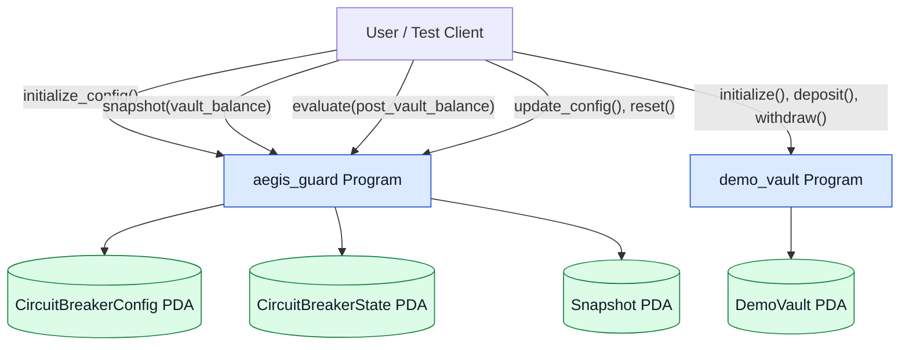
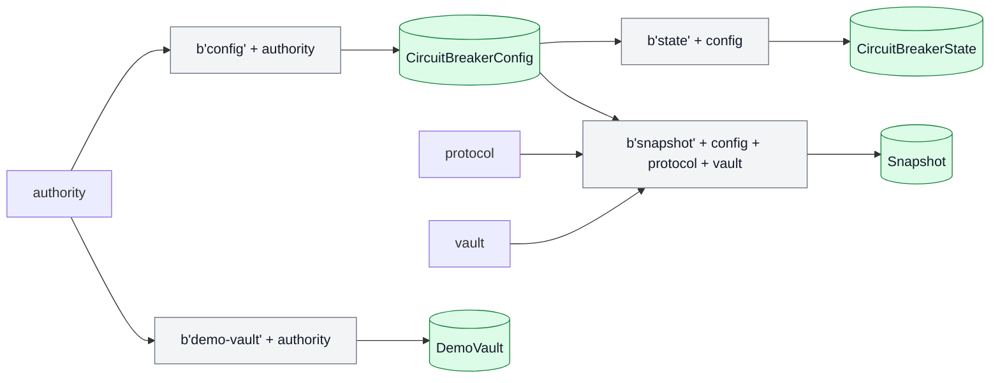
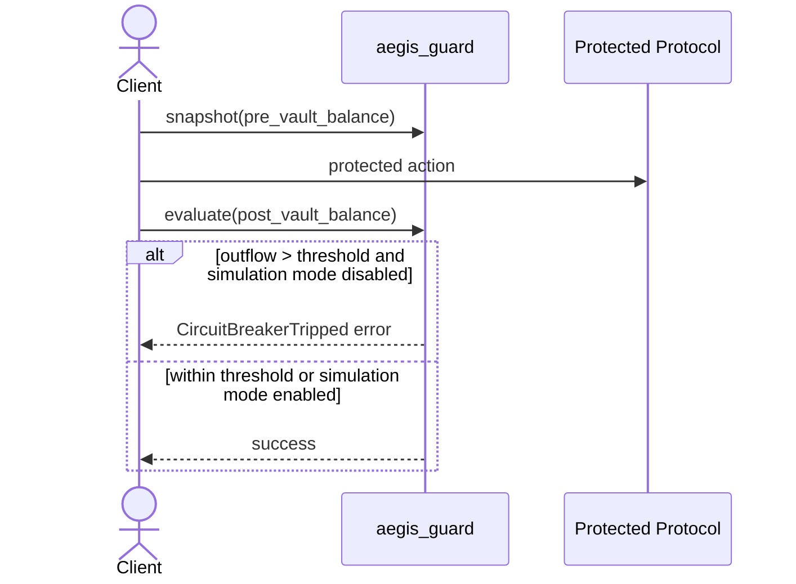
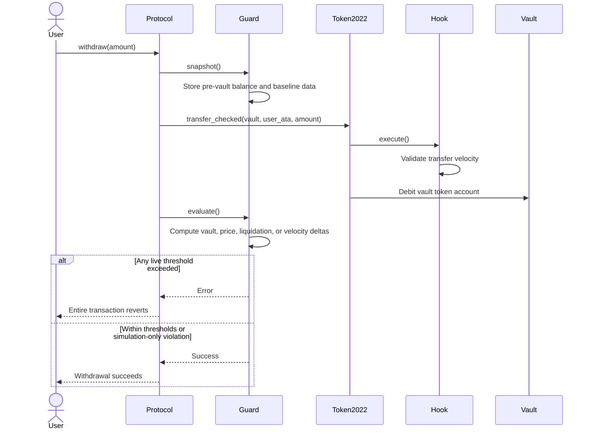
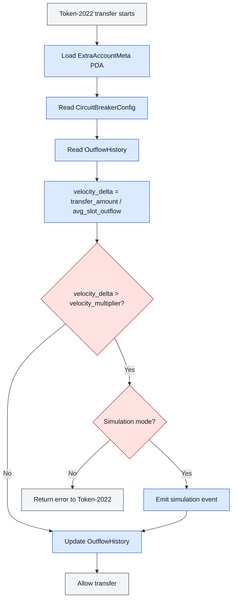

# Aegis Architecture

## Synchronous On-Chain Circuit Breaking for Solana Protocols

Aegis is a Solana security protocol prototype for stopping abnormal protocol
state changes before they commit on-chain.

The core primitive is an inline guard:

```text
snapshot pre-action state -> run protected action -> evaluate post-action state
```

If the post-action state crosses a configured safety threshold, the guard can
return an error inside the same transaction. Because Solana transactions are
atomic, that error rolls back the earlier protected action too.

## Architecture Status

This document is split into two layers:

1. **Current MVP Architecture**
   - Describes what this repository implements today.
   - Covers the `aegis_guard` and `demo_vault` programs.
   - Matches the current Rust code and TypeScript smoke test.

2. **Target Architecture**
   - Describes the broader intended Aegis design.
   - Includes Token-2022 transfer hooks, oracle checks, history accounts,
     monitoring, and richer governance flows.
   - These pieces are design goals, not current implementation.

## 1. Current MVP Architecture

The MVP implements the inline guard layer only.

Implemented programs:

| Program | Status | Purpose |
| --- | --- | --- |
| `aegis_guard` | Implemented | Stores guard config/state, records snapshots, evaluates vault outflow, and trips on threshold breach |
| `demo_vault` | Implemented | Minimal demo protocol with an internal `u64` balance |

Not currently implemented:

- Token-2022 transfer hook program
- SPL Token or Token-2022 vault accounting
- Pyth oracle integration
- price or liquidation anomaly checks
- historical outflow or price baseline accounts
- off-chain monitoring CLI
- end-to-end guarded withdrawal test
- CPI integration from `demo_vault` into `aegis_guard`

### Current Program Diagram



In the final integration, the protected protocol should call the guard through
CPIs. Today, the test/client can call both programs directly, and the demo vault
does not yet invoke the guard internally.

## 2. Current Program Structure

Both programs use the same modular Anchor layout:

```text
src/
├── lib.rs
├── errors.rs
├── state.rs
└── instructions/
    ├── mod.rs
    └── one_file_per_instruction.rs
```

`lib.rs` exposes the public Anchor instruction entrypoints. The real handlers
and account validation contexts live under `instructions/`. State structs live
in `state.rs`, and custom Anchor errors live in `errors.rs`.

### `aegis_guard`

Public instructions:

| Instruction | Purpose |
| --- | --- |
| `initialize_config` | Creates the guard config PDA and state PDA |
| `snapshot` | Stores pre-action vault balance metadata |
| `evaluate` | Compares post-action balance against the snapshot and threshold |
| `update_config` | Lets the authority update thresholds, pause state, and simulation mode |
| `reset` | Clears trip state |

Current files:

```text
programs/aegis_guard/src
├── errors.rs
├── instructions
│   ├── evaluate.rs
│   ├── initialize_config.rs
│   ├── mod.rs
│   ├── reset.rs
│   ├── snapshot.rs
│   └── update_config.rs
├── lib.rs
└── state.rs
```

### `demo_vault`

Public instructions:

| Instruction | Purpose |
| --- | --- |
| `initialize` | Creates the demo vault PDA |
| `deposit` | Adds to the vault's internal balance |
| `withdraw` | Subtracts from the vault's internal balance after an available-balance check |

Current files:

```text
programs/demo_vault/src
├── errors.rs
├── instructions
│   ├── deposit.rs
│   ├── initialize.rs
│   ├── mod.rs
│   ├── update_balance.rs
│   └── withdraw.rs
├── lib.rs
└── state.rs
```

## 3. Current Account Model

### `CircuitBreakerConfig`

Owned by `aegis_guard`.

Stores:

| Field | Meaning |
| --- | --- |
| `authority` | Governance/admin authority for this config |
| `velocity_multiplier_bps` | Stored for future velocity checks; not used in current evaluation |
| `max_outflow_bps` | Maximum allowed outflow in basis points |
| `cooldown_slots` | Stored for future cooldown enforcement |
| `is_simulation_mode` | If true, excessive outflow records trip metadata without aborting |
| `is_paused` | If true, snapshot/evaluate-style guard actions fail |
| `bump` | PDA bump |

### `CircuitBreakerState`

Owned by `aegis_guard`.

Stores:

| Field | Meaning |
| --- | --- |
| `is_tripped` | Whether the guard has recorded a trip |
| `tripped_at_slot` | Slot when the trip was recorded |
| `trip_reason` | Current trip reason enum |
| `delta_value_at_trip` | Outflow observed at trip time |
| `threshold_at_trip` | Threshold used at trip time |
| `bump` | PDA bump |

Current trip reasons:

```text
None
VaultOutflow
```

### `Snapshot`

Owned by `aegis_guard`.

Stores:

| Field | Meaning |
| --- | --- |
| `config` | Config PDA this snapshot belongs to |
| `protocol` | Protocol signer recorded for this snapshot |
| `vault` | Vault account key recorded for this snapshot |
| `pre_vault_balance` | Balance before the protected action |
| `snapshot_slot` | Slot when the snapshot was created |
| `bump` | PDA bump |

### `DemoVault`

Owned by `demo_vault`.

Stores:

| Field | Meaning |
| --- | --- |
| `authority` | Authority allowed to mutate the demo vault |
| `balance` | Internal demo balance, stored as `u64` |
| `bump` | PDA bump |

`DemoVault` is not a token account. It is a simple program account used to
exercise protocol-like balance changes during MVP development.

## 4. Current PDA Seeds

The current implementation derives accounts with these seeds:

```text
CircuitBreakerConfig: [b"config", authority]
CircuitBreakerState:  [b"state", config]
Snapshot:             [b"snapshot", config, protocol, vault]
DemoVault:            [b"demo-vault", authority]
```



## 5. Current Guard Flow

The intended MVP flow is:



In a production integration, the protected protocol should perform the guard
calls as CPIs around its sensitive action. The current `demo_vault` does not
perform those CPIs yet.

## 6. Current Evaluation Logic

`evaluate` checks that:

1. The guard is not paused.
2. The supplied snapshot belongs to the supplied config.
3. The supplied snapshot belongs to the supplied protocol signer.
4. The supplied snapshot belongs to the supplied vault key.

Then it computes:

```text
outflow = pre_vault_balance - post_vault_balance
threshold = pre_vault_balance * max_outflow_bps / 10_000
```

Decision:

```text
if outflow > threshold:
    set CircuitBreakerState.is_tripped = true
    record trip slot, reason, outflow, and threshold

    if is_simulation_mode == false:
        return CircuitBreakerTripped
```

Basis points:

```text
10_000 bps = 100%
1_000 bps = 10%
100 bps = 1%
```

Example:

```text
pre_vault_balance = 1,000
post_vault_balance = 850
max_outflow_bps = 1,000

threshold = 1,000 * 1,000 / 10,000 = 100
outflow = 1,000 - 850 = 150

150 > 100, so the circuit breaker trips.
```

## 7. Current Limitations

The current MVP is intentionally narrow.

Important limitations:

1. `snapshot` and `evaluate` receive balance values as instruction arguments.
   They do not yet read SPL Token accounts directly.
2. `demo_vault` stores a plain internal `u64` balance, not protected token
   liquidity.
3. `demo_vault` does not CPI into `aegis_guard`; integration is still manual
   from the client/test layer.
4. `CircuitBreakerState.is_tripped` is recorded but not yet used to block future
   guarded actions.
5. `cooldown_slots` is stored but not enforced by `reset`.
6. `velocity_multiplier_bps` is stored but not used in the current outflow
   evaluation.
7. Simulation mode records trip metadata but does not emit a dedicated Anchor
   event or structured log.
8. The current TypeScript test is an initialization smoke test, not a full
   atomic rollback test.

## 8. Target Architecture

The target design extends the MVP with three layers:

1. **Inline Guard Layer**
   - Implemented in MVP.
   - Protects protocol-level actions with `snapshot -> action -> evaluate`.
   - Eventually reads real token/account state directly instead of trusting
     balance arguments.

2. **Transfer Hook Layer**
   - Planned.
   - Uses Token-2022 transfer hooks.
   - Evaluates transfer velocity at the mint level.
   - Blocks abnormal token movement before the transfer completes.

3. **Governance and Monitoring Layer**
   - Partially implemented through authority-controlled config updates and
     reset.
   - Planned additions include structured simulation events, off-chain threshold
     analysis, multisig workflows, and richer reset/cooldown policy.

### Target System Diagram

```mermaid
flowchart TB
    User["Protocol User"]
    Protocol["Protocol Program"]
    Guard["Aegis Guard Program"]
    Hook["Aegis Transfer Hook Program"]
    Token2022["Token-2022 Program"]

    Config[("CircuitBreakerConfig PDA")]
    State[("CircuitBreakerState PDA")]
    Snapshot[("Snapshot PDA")]
    Outflow[("OutflowHistory PDA")]
    Price[("PriceHistory PDA")]
    Extra[("ExtraAccountMeta PDA")]
    Vault["Protocol Vault Token Account"]

    Pyth{{"Pyth Oracle"}}
    Gov["Governance Multisig"]
    Monitor(["Off-Chain Monitoring CLI")]

    User -->|"deposit(), withdraw(), stake(), claim_rewards()"| Protocol
    Protocol -->|"CPI: snapshot()"| Guard
    Protocol -->|"Token transfer"| Token2022
    Protocol -->|"CPI: evaluate()"| Guard
    Protocol --> Vault

    Token2022 -->|"Execute transfer hook"| Hook
    Hook -->|"Read thresholds"| Config
    Hook -->|"Read/update transfer history"| Outflow
    Hook -->|"Read extra account metadata"| Extra

    Guard -->|"Read thresholds"| Config
    Guard -->|"Read/update trip state"| State
    Guard -->|"Create/read pre-state"| Snapshot
    Guard -->|"Read transfer baselines"| Outflow
    Guard -->|"Read price baselines"| Price

    Pyth -->|"Price feed account"| Guard
    Monitor -->|"Analyze simulation events"| Gov
    Gov -->|"update_config(), reset(), pause/unpause"| Guard

    classDef program fill:#dbeafe,stroke:#1d4ed8,color:#111827
    classDef pda fill:#dcfce7,stroke:#15803d,color:#111827
    classDef token fill:#fef3c7,stroke:#b45309,color:#111827
    classDef oracle fill:#fce7f3,stroke:#be185d,color:#111827
    classDef external fill:#ede9fe,stroke:#6d28d9,color:#111827

    class Protocol,Guard,Hook,Token2022 program
    class Config,State,Snapshot,Outflow,Price,Extra pda
    class Vault token
    class Pyth oracle
    class Monitor,Gov external
```

## 9. Target Account Additions

The target architecture may add these accounts:

| Account | Owner | Purpose |
| --- | --- | --- |
| `OutflowHistory` | Guard or Hook | Tracks historical token outflow baselines |
| `PriceHistory` | Guard | Stores EMA or price samples for price anomaly checks |
| `ExtraAccountMeta` | Hook | Registers extra accounts required by Token-2022 transfer hooks |
| Token vault account | Token program | Stores real protected assets |
| User token account | Token program | Stores user-owned tokens |
| Token-2022 mint | Token-2022 program | Mint configured with transfer hook extension |

Target PDA seeds should remain deterministic and scoped to the protected
protocol, mint, vault, or market so different deployments do not share risk
state accidentally.

## 10. Target Interaction Matrix

| Source | Target | Interaction Type | Purpose |
| --- | --- | --- | --- |
| User | Protocol Program | Transaction instruction | User-facing DeFi operation |
| Protocol Program | Aegis Guard Program | CPI | Capture pre-action state |
| Protocol Program | Token-2022 Program | CPI | Move protected assets |
| Token-2022 Program | Aegis Transfer Hook Program | Hook callback | Validate transfer before completion |
| Protocol Program | Aegis Guard Program | CPI | Evaluate post-action state |
| Aegis Guard Program | Pyth Oracle / PriceHistory | Account read | Detect abnormal price movement |
| Aegis Guard Program | OutflowHistory | Account read | Detect abnormal outflow velocity |
| Governance Multisig | Aegis Guard Program | Admin instruction | Tune thresholds and recover from trips |
| Off-Chain Monitor | Governance Multisig | Report | Support threshold calibration |

## 11. Target Withdrawal Flow



## 12. Target Transfer Hook Flow



## 13. Target Delta Calculations

The current MVP only implements vault outflow thresholding. Future versions can
add more signals:

### Vault Outflow Delta

```text
outflow = pre_balance - post_balance
threshold = pre_balance * max_outflow_bps / 10_000
```

### Price Delta

```text
price_delta = abs(current_price - ema_price) / ema_price
```

### Liquidation Delta

```text
liq_delta = current_liq_rate / historical_liq_rate
```

### Transfer Velocity Delta

```text
velocity_delta = transfer_amount / avg_slot_outflow
```

## 14. Security Assumptions

Current MVP assumptions:

1. The caller supplies accurate pre-action and post-action balances.
2. The protected protocol or integration test calls `snapshot` before the
   protected action and `evaluate` after it.
3. The authority that controls config updates is trusted.

Target architecture assumptions:

1. The integrated protocol performs guard CPIs in the correct order.
2. The governance multisig remains uncompromised.
3. Oracle price feeds remain available and accurate enough for configured
   thresholds.
4. Historical baselines represent normal protocol behavior.
5. Token-2022 transfer hooks are configured on protected mints.
6. Required hook accounts are correctly registered through the
   `ExtraAccountMeta` PDA.

## 15. Roadmap From MVP To Target Architecture

Recommended implementation order:

1. Add an end-to-end Anchor test for `snapshot -> demo_vault withdraw ->
   evaluate`.
2. Enforce `CircuitBreakerState.is_tripped` in guarded paths.
3. Enforce `cooldown_slots` in `reset`.
4. Emit structured Anchor events for trips and simulation-mode violations.
5. Add CPI integration from `demo_vault` into `aegis_guard`.
6. Replace internal demo balances with SPL Token or Token-2022 vault balances.
7. Add historical outflow tracking.
8. Add Token-2022 transfer hook protection.
9. Add oracle/price-history checks if the protected protocol needs them.
10. Add off-chain monitoring for threshold calibration.

## Summary

The repository currently implements the core inline guard MVP: configuration,
snapshotting, threshold-based outflow evaluation, trip-state recording,
simulation mode, and a minimal demo vault.

The full Aegis architecture extends that primitive into a broader security
system with real token vaults, Token-2022 transfer hooks, historical baselines,
oracle-aware checks, and governance/monitoring workflows. Those future layers
are intentionally documented here as target architecture, not as current code.
